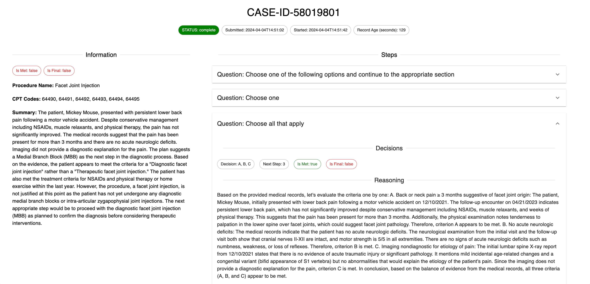

# Senior Product Engineer Take-Home

View instructions for completing this take-home assignment [here](https://co-helm.notion.site/Senior-Product-Engineer-Take-Home-6e82ec45cc2a46b59a0d9ee3aeb9449c).

## Getting Started

There are three main areas of this project:
1. MySQL Database Setup + Alembic Initial Migration
2. FastAPI Backend Service + Typescript Frontend Client Generation
3. Frontend Node Installation + Running + Linting

To ensure that the application runs correctly, you will need to follow the instructions in 
each of the directories in that order.

## Database Documentation + Setup

To view the database documentation, navigate to the `backend/db` directory and open the `README.md` file.

## Backend Documentation + Setup

To view the backend documentation, navigate to the `backend` directory and open the `README.md` file.

## Frontend Documentation + Setup

To view the frontend documentation, navigate to the `frontend` directory and open the `README.md` file.

## Preview

Here is an example of what the case page looks like 

## Loom Video

https://www.loom.com/share/3ecc6267bc814d2b94dbce24c30dad73?sid=9c168c44-79dc-4b6e-a6c5-2014c0b2bc24

## Notes

Just some notes on the choices I made.

#### Testing

There is not a lot of testing in this project, which is something that I dont normally do, however
provided the time that I had available to complete this and ensuring that the features were completed, 
I let that go a bit by the wayside. 

#### Database

For the backend here I opted to actually use a locally running MySQL database. I did this mostly out of 
convenience and to avoid having to set up a cloud database anywhere. I used Alembic for migrations and
SQLAlchemy for the ORM.

This all just felt like a complete solution to the problem, even though it introduces some complexity. 

For updating the models on some "mock" processing, I just took an initial model for a Case and merged
in the new data depending on the stage that the case was supposed to be in. This was a bit of a hack
but it seemed to work well enough for the purposes of the take-home.

#### Frontend

I simplified some of the formatting on the front end, because it is my weakest area, by using the MUI
library. Additionally I chose `prettier` for code formatting since it is a tool I am familiar with.
